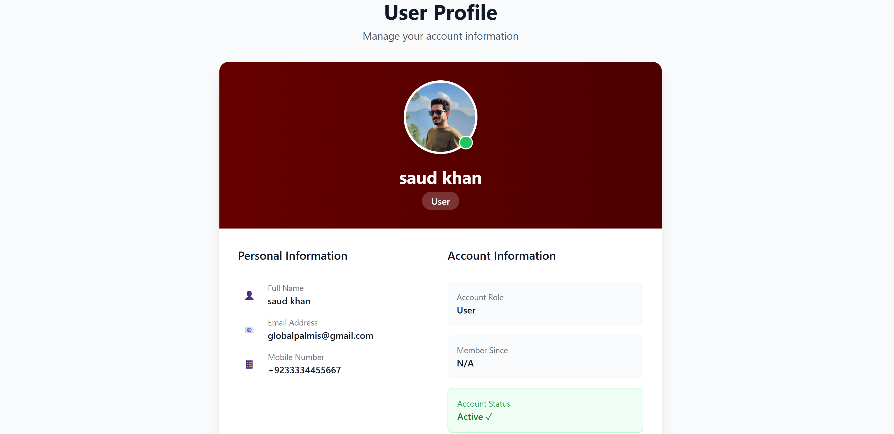

# Galvan Project

## Project Description
This project contains both the **frontend** (Next.js) and **backend** (Flask) for the Galvan application.  
It includes features such as user authentication with OTP, admin dashboard, and user management.

---

## Repository Structure
```
galvan/
├── backend/   # Flask API backend
├── frontend/  # Next.js frontend application
├── README.md
├── screenshots/
```
---

## Setup Instructions

### 1. Backend Setup (Flask)

#### Install dependencies:
```bash
cd backend
pip install -r requirements.txt
```

#### Create `.env` file inside `backend` folder with:
```
FLASK_ENV=development
SECRET_KEY=123456
JWT_SECRET_KEY=123456
DATABASE_URL=sqlite:///data.db
SMTP_HOST=smtp.gmail.com
SMTP_PORT=587
SMTP_USER=ksaud8883@gmail.com
SMTP_PASSWORD=fmrwvramjbbekogv
EMAIL_FROM=GalvanAI <ksaud8883@gmail.com>

SUPERADMIN_EMAIL=superadmin@example.com
SUPERADMIN_PASSWORD=superstrongpassword
```

#### Run backend:
```bash
python app.py
```

The backend will run on:  
```
http://localhost:5000
```

---

### 2. Frontend Setup (Next.js)

#### Install dependencies:
```bash
cd frontend
npm install
```

#### Run frontend:
```bash
npm run dev
```

The frontend will run on:  
```
http://localhost:3000
```

---

## Cloning the Repository
```bash
git clone https://github.com/saudkhan100/galvan_task.git
cd galvan
```

Then follow the backend and frontend setup steps above.

---

## Environment Variables

**Backend (.env):**
```
FLASK_ENV=development
SECRET_KEY=123456
JWT_SECRET_KEY=123456
DATABASE_URL=sqlite:///data.db
SMTP_HOST=smtp.gmail.com
SMTP_PORT=587
SMTP_USER=ksaud8883@gmail.com
SMTP_PASSWORD=fmrwvramjbbekogv
EMAIL_FROM=GalvanAI <ksaud8883@gmail.com>

SUPERADMIN_EMAIL=superadmin@example.com
SUPERADMIN_PASSWORD=superstrongpassword
```

---

## Dependencies

**Backend (`requirements.txt`):**
```
Flask==2.2.5
flask-restx==1.1.0
Flask-SQLAlchemy==3.0.2
PyJWT==2.8.0
passlib==1.7.4
python-dotenv==1.0.0
Flask-Cors==4.0.1
itsdangerous==2.1.2
```

**Frontend (`package.json`):**
```
(node_modules installed with `npm install`)
```

---

## Screenshots

### Home Page  


### Login Page  


### Registration with OTP  


### Verify OTP  


### Email OTP  


### Admin Dashboard  


### Admin Create user  


### Admin edit user


### User Profile 



---

## Notes
- Ensure both frontend and backend are running for full functionality.
- For the backend, install Python dependencies from `requirements.txt`.
- For the frontend, run `npm install` inside `frontend`.

---

## License
MIT License
